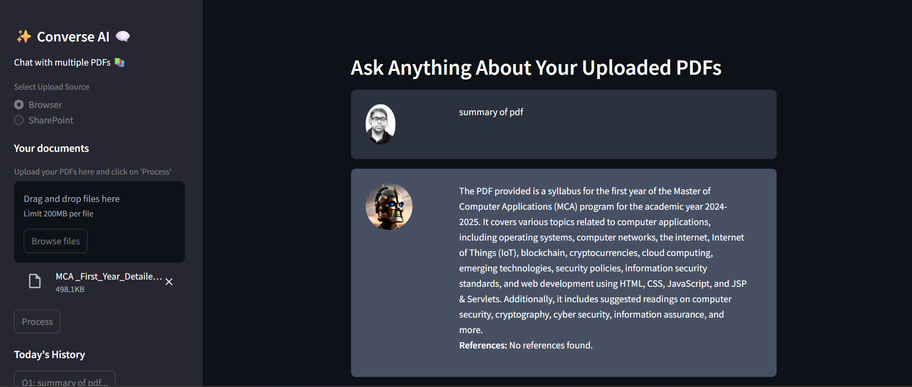

# ConverseAI - Chat with Multiple PDFs (Python)



## Overview

**ConverseAI** enables users to chat with multiple PDF documents using a Python-based chatbot powered by modern language models. By loading several PDFs, users can ask questions and receive context-aware answers synthesized from all documents.

## Features

- Load and process multiple PDF files simultaneously
- Natural language question-answering using Python and Transformers
- Intelligent context extraction from combined PDF content
- Simple and interactive chat interface (CLI or web-based optional)

## Prerequisites

- Python 3.8+
- pip

## Installation

Clone the repository and install dependencies:

git clone https://github.com/ram8528/ConverseAI-Chat-with-Multiple-PDF
cd converseai-multipdf
pip install -r requirements.txt

## Usage

1. Place your PDF files in the `pdfs` directory.
2. Run the script:
   ```
   python converseai.py
   ```
3. Enter your questions in the chat interface. ConverseAI will respond using information from all PDFs.

## Example

converseai.py
import os
import PyPDF2
from transformers import pipeline

def read_pdfs(pdf_folder):
content = ""
for filename in os.listdir(pdf_folder):
if filename.endswith('.pdf'):
with open(os.path.join(pdf_folder, filename), 'rb') as f:
reader = PyPDF2.PdfReader(f)
for page in reader.pages:
content += page.extract_text() + "\n"
return content

def main():
print("Welcome to ConverseAI Chat with Multiple PDFs.")
pdf_folder = 'pdfs'
print(f"Loading PDFs from '{pdf_folder}'...")
pdf_content = read_pdfs(pdf_folder)

# Use a lightweight Q&A pipeline model (replace with your own model)

qa_pipeline = pipeline('question-answering', model='distilbert-base-uncased-distilled-squad')
while True:
question = input("\nYou: ")
if question.lower() in ['exit', 'quit']:
print("Goodbye!")
break

# Here, we keep input length concise for demo

result = qa_pipeline({'question': question, 'context': pdf_content[:3000]})
print("ConverseAI:", result['answer'])

if name == "main":
main()

## Contributing

Pull requests are welcome! Please open an issue first for major changes.  
For questions and feedback, see our [Issues](https://github.com/ram8528/ConverseAI-Chat-with-Multiple-PDF).

## License

MIT License

---

**Replace `assets/local.png` above with your actual image link or file path (e.g., `docs/banner.png`).**

If you need the code expanded for a Flask/Streamlit app or want additional features, just let me know!
